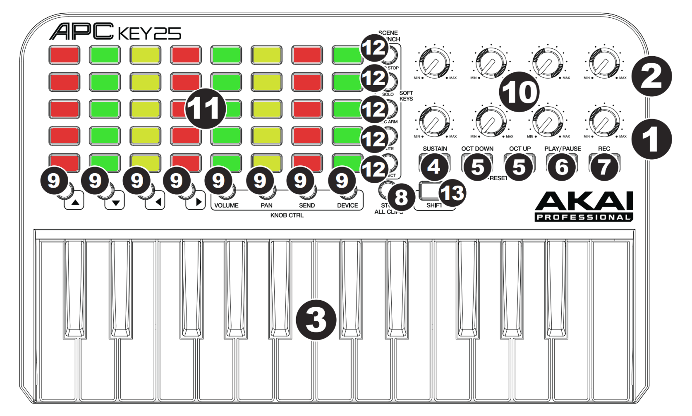

# APC Key 25 Pallete - Coloring Your Old Drumpad

This project provides utilities to manage your AKAI Professional
APC Key 25 MIDI controller.

According to the official manual, this MIDI controller is compatible
with Ableton, so you may be disappointed when you plug it into your
Linux/Windows setup with a DAW other than Ableton.

Luckily, most operating systems automatically recognise the controller
as a MIDI device over USB, so you don't need to install weird drivers.



However, you may struggle to set the drum pad button colors, as that
is something Ableton supposedly does. This project allows you to
set your own colours and properties of the APC Key 25.

**Note**: This is supposed to work for the AKAI APC Key 25, **NOT** the
AKAI APC Key 25 MK2.

## Build Instructions

This is a fairly small `cmake` project, using `conan` for the dependency
management. Given you have a recent version of both tools, run the
following commands:

```bash
conan export conan/alsa-system --name=libalsa --version=system
conan install . -of=conan/deb --build=missing -sbuild_type=Debug
cmake --preset unix-deb-ninja
cmake --build --preset unix-deb-ninja
```

Here's a little explanation of the commands above:

+ `conan export ...` will setup the `libalsa` package, which just
wraps the system `libalsa`. This is needed to override the
transient dependency of `RtMIDI`.
+ `conan install ...` will actually install all the dependencies
of this project (loggers, midi, etc). Take a look at the
`conanfile.py` if you want to see all the dependencies.
+ `cmake --preset ...` will configure the CMake project. For a
list of supported presets, run `cmake --list-presets`.
+ `cmake --build --preset ...` will actually build. The resulting
build files will be located at `build/<preset-name>/`.

### Supported Presets / Build Types

The goal is to support all major operating systems, hence why
the main MIDI communication dependency is `RtMIDI` - it supports
Linux through `alsa`, Windows through `multimedia library` and
`UWP`, and Mac through `CoreMIDI` and `JACK`.

Here are the currently supported platforms and the equivalent
CMake `--preset`:

+ [x] Linux Debug with the preset `unix-deb-ninja`.
+ [x] Linux Release with the preset `unix-rel-ninja`.
+ [ ] Windows Debug with the preset `vs2022-deb`.
+ [ ] Windows Release with the preset `vs2022-rel`.
+ [ ] Mac Debug - no preset yet.
+ [ ] Mac Release - no preset yet.

**Note:** If you have a mac and want to help me with build
and testing, please get in touch!

## udev Rules on Linux - Run As Soon as The Device is Pluged in

If you want to run this program automatically when the device is
plugged in via USB, you can create some `udev` rules.

Firstly, write a wrapper script and add it somewhere that is
accessible to `udev` running as root:

```bash
#!/bin/bash

sleep 2
<PATH-TO>/apc25-pallete/build/unix-deb-ninja/apc25_pallete/apc25_pallete --device-name "APC Key 25:APC Key 25 MIDI 1 20:0"
```

For example, I saved the above script in `/usr/local/bin/apc-keys.sh`.
Make sure you replace `<PATH-TO>` with the actual path to the directory
where you cloned the repository. Also, change the build directory
according to the preset you used.

Then, create the actually `udev` rule in `/usr/lib/udev/rules.d/99-apc-keys.rules`:

```
ACTION=="add", SUBSYSTEM=="sound", KERNEL=="midiC*", ATTRS{idVendor}=="09e8", ATTRS{idProduct}=="0027", RUN+="/usr/bin/logger APC Key 25 connected", RUN+="/usr/local/bin/apc-connected.sh"
```

Then just reload the `udev` rules:

```bash
sudo udevadm control --reload-rules
sudo udevadm trigger
```
